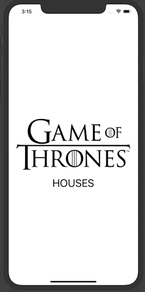
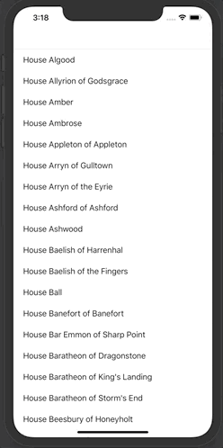
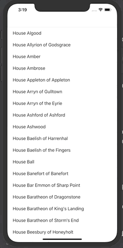
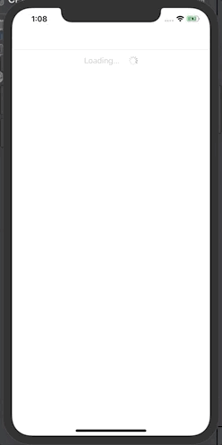

Game of Thrones Houses Table View Project:
==========================

Demo
-----------
The user must tap on the splashscreen to view all Game of Throne houses

The user can tap on a house to view more details:

When the user scrolls to the bottom, more houses load:
The user can tap on a house to view more details:

In the case that the user's network connection is slow, they will see the loading cell:

and if there are no resuts returned, the user will see this (however this should never happen):

